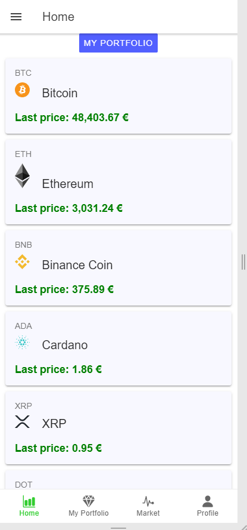

# ionic-app-cryptopanda
Crypto Panda is mobile app for tracking your crypto assets and connecting with people who are willing to sell/buy cryptocurrencies. 

## Development

using Ionic, Angular, Firebase, IDE - Visual Studio Code

## Design

Home Page                  |  Star Rank Page           |  Fork Rank Page | Home Page                  |  Star Rank Page           |  Fork Rank Page
:-------------------------:|:-------------------------:|:-------------------------: |:-------------------------: |:-------------------------: |:-------------------------:
  |   | 
  |   | 
